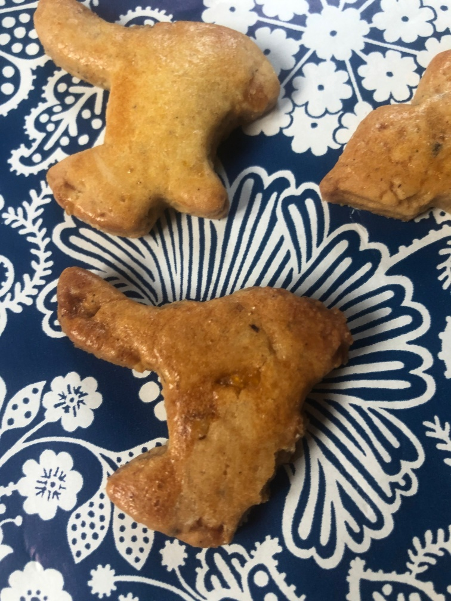
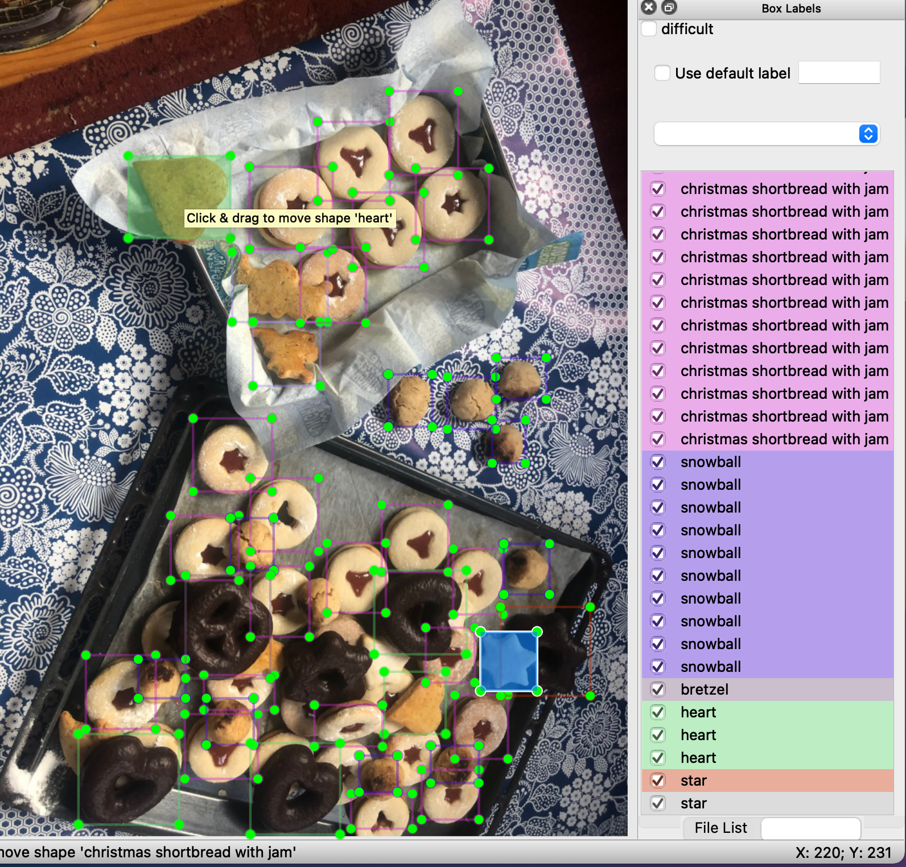

# The Bredele hackathon
  by dotnetmobile@gmail.com
---

## Proof of concept based on a [Raspberry pi 4 (8GB RAM)](https://www.raspberrypi.org/products/raspberry-pi-4-model-b/) and a [Coral USB device](https://coral.ai/products/accelerator) for detecting [Bredele](https://en.wikipedia.org/wiki/Bredele) using the [TensorFlow Machine Learning platform version 2](https://www.tensorflow.org) and the [Faster RCNN Inception model](https://tfhub.dev/tensorflow/faster_rcnn/inception_resnet_v2_1024x1024/1).

All credits go to the authors (@EdjeElectronics + @tensorflow) of the following remarkable references:

* [TensorFlow-Lite-Object-Detection-on-Android-and-Raspberry-Pi](https://github.com/EdjeElectronics/TensorFlow-Lite-Object-Detection-on-Android-and-Raspberry-Pi)
* [How To Train an Object Detection Classifier for Multiple Objects Using TensorFlow (GPU) on Windows 10](https://github.com/EdjeElectronics/TensorFlow-Object-Detection-API-Tutorial-Train-Multiple-Objects-Windows-10)
* [TensorFlow](https://github.com/tensorflow)
* [TensorFlow models](https://github.com/tensorflow/models)
* [TensorFlow model configurations](https://github.com/tensorflow/models/blob/master/research/object_detection/g3doc/tf2_detection_zoo.md)

---
## Context

I successfully deployed on my Raspberry Pi all the installation steps of the excellent tutorial [TensorFlow-Lite-Object-Detection-on-Android-and-Raspberry-Pi](https://github.com/EdjeElectronics/TensorFlow-Lite-Object-Detection-on-Android-and-Raspberry-Pi).<br>
I noticed that the objects detection trained model was time to time mismatching objects like apples, oranges and balls.<br>
Therefore I decided to retrain the model in order to see if I can get a better object detection.<br>
As it was the Christmas period and we cooked quite a lot of Bredele, I trained the Faster RCNN Inception model using our own cookies.
It was a good starting point for using TensorFlow :wink:

---

## Objects

The trained model should be able to detect 16 different object types:

|  Id  | Name                                 | Comment                      |
|:----:|--------------------------------------|------------------------------|
|1     |   | |
|2     |  | |
|3     |  | commercial |
|3     |  | |
|4     |  | |
|5     |  | |
|6     |  | |
|6     |  | |
|7     |  | |
|8     |  | |
|9     |  | |
|10    |  | |
|11    |  | commercial |
|11    |  | |
|12    |  | forgot baker's yeast :joy: |
|13    | weird #2 | forgot baker's yeast :joy: |
|14    |  | |
|15    |  | |
|16    |  | commercial |

---

## Labels

| labels collection |
| ------------------- |
|  |
|  |
|  |
|  |
|  |
|  |
|  |
|  |


---
## Environment

* OS: [MacOS Big Sur](https://www.apple.com/uk/macos/big-sur/)
* [Anaconda 1.10.0](https://www.anaconda.com) with Python 3.8
* [TensorFlow Object Detection Git repository](https://github.com/tensorflow/models)
* [LabelImg](https://github.com/tzutalin/labelImg) for objects annotation
* [EdgeElectronics git repository](https://github.com/EdjeElectronics/TensorFlow-Object-Detection-API-Tutorial-Train-Multiple-Objects-Windows-10/archive) instructions for training the model

## Setup the bredele hackathon environment

Follow instructions described in [INSTALL.md](https://github.com/dotnetmobile/bredele-hackathon/blob/main/INSTALL.md)

Please note that all bredele images used for the training and the testing have the size of 756x1008 (width x heigh). <br>
So the original <br>
```
faster_rcnn_inception_resnet_v2_1024x1024_coco17_tpu-8.config
```
has been cloned in <br>
```
faster_rcnn_inception_resnet_v2_756x1008_coco17_tpu-8.config
```
and adapted to fit with the corresponding images size.


___
